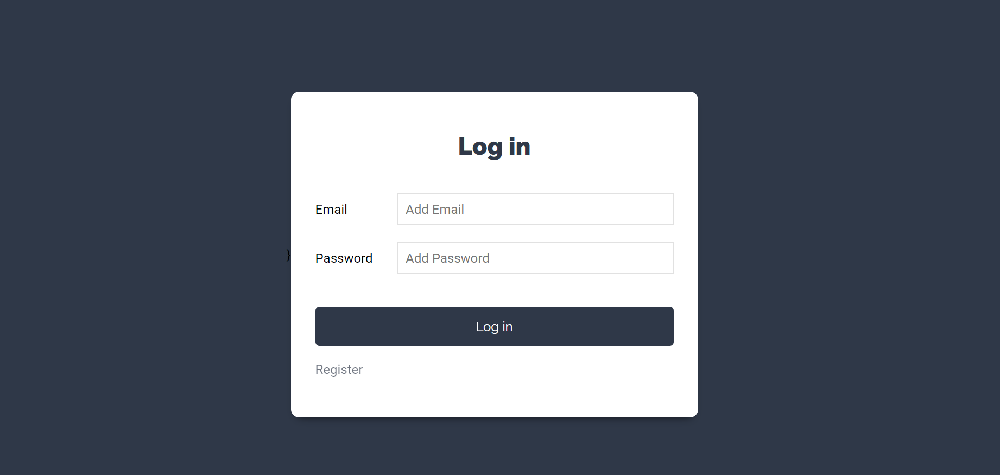
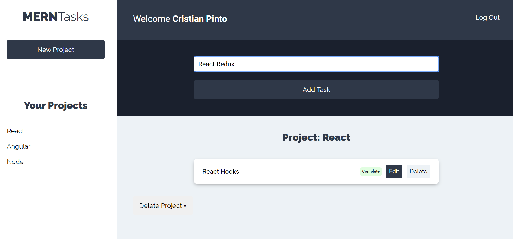
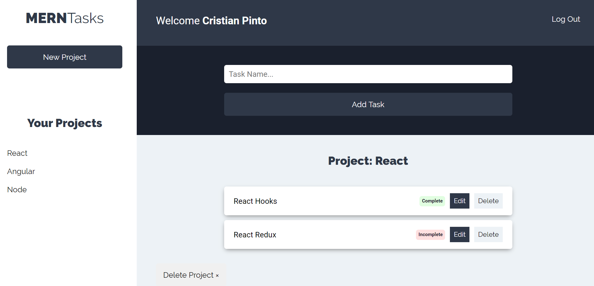

# Task-Project-Backend
### Developed by Cristian David Pinto - 2020
Project created using MERN (mongodb, express, react, node).

Backend created with node, express, and mongodb.

### Website: 
https://vibrant-heisenberg-53ed36.netlify.app/

### Frontend Code: 
https://github.com/crims123/React-Hooks-Context-Task-Project-Frontend

### Backend Code: 
https://github.com/crims123/Node-Express-Mongo-Task-Project-Backend

### Screenshots:
### User panel login and register 

### Create multiples projects 

### Create, edit and delete tasks in every project

